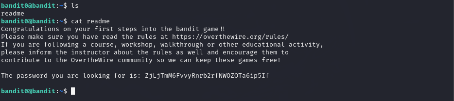
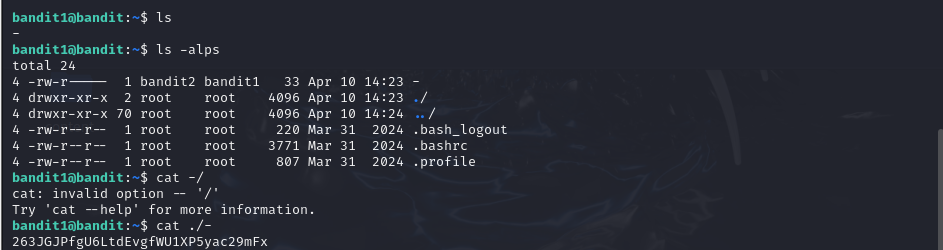
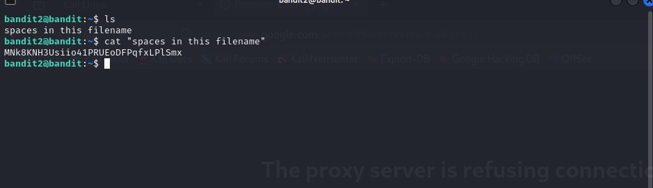
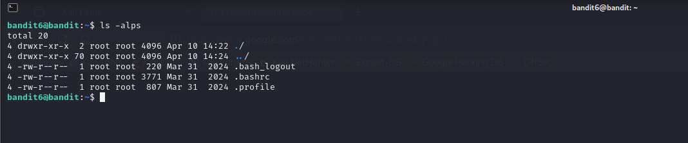
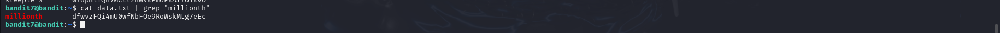
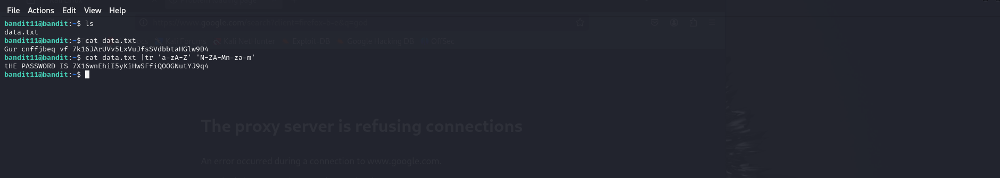
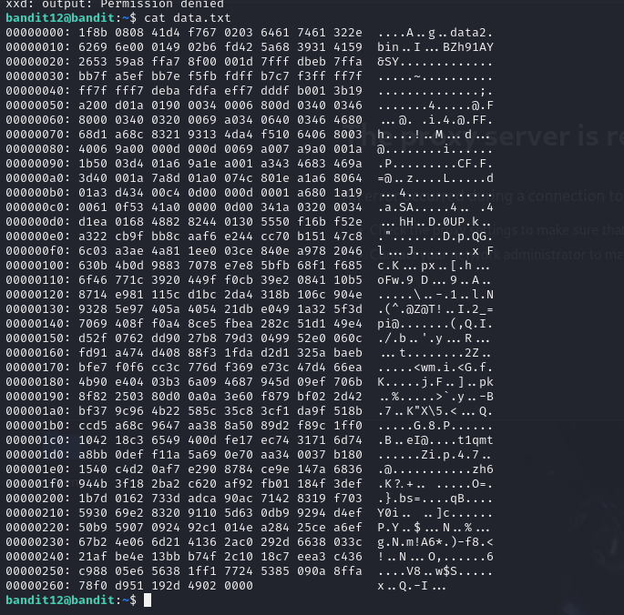

# OverTheWire: Bandit Showcase

A visual log of my progression through the [OverTheWire Bandit](https://overthewire.org/wargames/bandit/) wargame, demonstrating practical command-line operations, file permissions, and text manipulation in a Linux environment.

---

### Levels 00 - 05: Core Navigation
**Concepts applied:** `ssh`, `ls -la`, `cat`, handling spaces and hidden files.

<b>📸 View Terminal Execution</b>

 

---

### Levels 06 - 10: Searching & Encoding
**Concepts applied:** `find`, `grep`, `sort`, `uniq`, `base64`, file sizes.

<b>📸 View Terminal Execution</b>

 

---

### Levels 11 - 15: Hexdumps & Archiving
**Concepts applied:** `tr` (ROT13), `xxd`, `tar`, `gzip`, `bzip2`.

<b>📸 View Terminal Execution</b>

 

